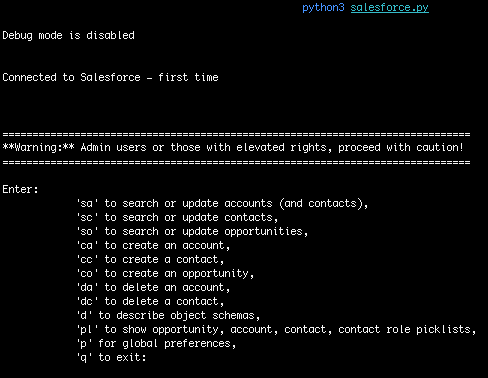

# Learning Salesforce's API

Salesforce is a Customer Relationship Management "CRM" web application. This example uses the API to query the CRM.



## Programming language

This example uses Python and is a command line application

## API

Simple Salesforce is a basic Salesforce.com client built for Python. It uses username, password and security token authentication via SOAP to generate a session Id used for subsequent REST APIs calls.  See [sfdc-go](https://github.com/sharkymark/sfdc-go) for an example of using OAuth2 and Salesforce Connected App's Consumer Key and Consumer Secret and the deployment's Salesforce instance Url. Simple Salesforce supposedly has OAuth support but I have not tested it.

## Authentication

Credentials include username, password, and token. They are read as environment variables which you place in `.zshrc` or `.bashrc`

```sh
# set SalesForce environment variables
export SALESFORCE_USERNAME_1=""
export SALESFORCE_PASSWORD_1=""
export SALESFORCE_SECURITY_TOKEN_1=""
```

Retrieve the security token from the Salesforce UI, View Profile -> Settings -> Reset My Security Token

## Multiple Salesforce deployment support

The app allows up to 2 Salesforce deployments. When the app starts, the first one entered is loaded. There is an action in the CLI to switch to another deployment if environment variables have been entered.

```sh
# set environment variables
export SALESFORCE_USERNAME_1=""
export SALESFORCE_PASSWORD_1=""
export SALESFORCE_SECURITY_TOKEN_1=""
export SALESFORCE_USERNAME_2=""
export SALESFORCE_PASSWORD_2=""
export SALESFORCE_SECURITY_TOKEN_2=""
```

## Run the app

`cd` into the repo directory and run the app

```sh
python3 salesforce.py
```

Alternatively, see the dev container approach below which autostarts the app.

## The app 

The app runs as a while loop prompting the user for actions like:
1. creating & updating accounts, contacts, opportunities, opportunity contact roles and tasks
1. describing the account, contact, opportunity, and contact role object schemas
1. searching Salesforce cccount records by the Name column with an option to retrieve contacts
1. deleting accounts, contacts and opportunity contact roles
1. searching contacts by name, title, email with an option to update them
1. show picklists values for account, contact, opportunity and contact role objects
1. allow picklist support for: lead source (contact), type (account), industry (account), Subject (task)
1. a global settings for additional account and contact columns to retrieve.

> Currently am not providing delete functionality for opportunities (revenue) by design.

## Dev Container

Notice the `Dockerfile` and `devcontainer.json` which uses a slim Python container image, adds the `simple_salesforce` module with `pip` in the Dockerfile, and passes the Salesforce authentication environment variables into the dev container.

This approach frees you up from having a specific Python version and module on your local machine e.g., Mac and let the dev container set all of this up. You do still need to set the environment variables locally which is more secure and better than putting into the repo with .gitignore. ☠️

## Resources

[Python Mac versions](https://www.python.org/downloads/macos/)

[simple_salesforce Python package](https://github.com/simple-salesforce/simple-salesforce)

[Salesforce APIs](https://developer.salesforce.com/docs/apis)

[Salesforce REST API](https://developer.salesforce.com/docs/atlas.en-us.api_rest.meta/api_rest/intro_what_is_rest_api.htm)

[dev container spec](https://containers.dev/implementors/json_reference/)

## License

This project is licensed under the [MIT License](LICENSE)

## Contributing

### Disclaimer: Unmaintained and Untested Code

Please note that this program is not actively maintained or tested. While it may work as intended, it's possible that it will break or behave unexpectedly due to changes in dependencies, environments, or other factors.

Use this program at your own risk, and be aware that:
1. Bugs may not be fixed
1. Compatibility issues may arise
1. Security vulnerabilities may exist

If you encounter any issues or have concerns, feel free to open an issue or submit a pull request.